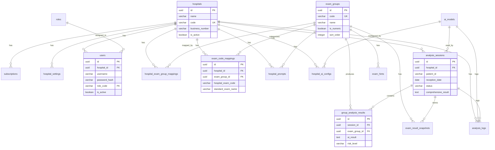

# Hospital Admin Backend - 데이터베이스 스키마 설계서

## 1. 개요

### 1.1 데이터베이스 정보
- **DBMS**: PostgreSQL 15+
- **문자셋**: UTF-8
- **Collation**: ko_KR.UTF-8
- **테넌트 격리**: Row-Level Security (RLS) with hospital_id

### 1.2 스키마 구조

```
hospital_admin
├── 테넌트 관리 (Tenant Management)
│   ├── hospitals
│   ├── subscriptions
│   └── hospital_settings
│
├── 사용자 관리 (User Management)
│   ├── roles
│   └── users
│
├── 검사 관리 (Exam Management)
│   ├── exam_groups
│   ├── hospital_exam_group_mappings
│   └── exam_code_mappings
│
├── 프롬프트 관리 (Prompt Management)
│   ├── prompt_templates
│   ├── hospital_prompts
│   └── exam_hints
│
├── AI 모델 관리 (AI Model Management)
│   ├── ai_models
│   └── hospital_ai_configs
│
└── 분석 데이터 (Analysis Data)
    ├── analysis_sessions
    ├── group_analysis_results
    ├── exam_result_snapshots
    └── analysis_logs
```

---

## 2. 테넌트 관리 도메인

### 2.1 hospitals (병원)

병원(테넌트) 기본 정보를 저장합니다.

```sql
CREATE TABLE hospitals (
    id UUID PRIMARY KEY DEFAULT gen_random_uuid(),
    name VARCHAR(200) NOT NULL,
    code VARCHAR(50) UNIQUE NOT NULL,
    business_number VARCHAR(50),
    address TEXT,
    contact_email VARCHAR(200),
    contact_phone VARCHAR(50),
    is_active BOOLEAN DEFAULT TRUE NOT NULL,
    created_at TIMESTAMP DEFAULT CURRENT_TIMESTAMP NOT NULL,
    updated_at TIMESTAMP DEFAULT CURRENT_TIMESTAMP NOT NULL
);

-- 인덱스
CREATE INDEX idx_hospitals_code ON hospitals(code);
CREATE INDEX idx_hospitals_is_active ON hospitals(is_active);

-- 코멘트
COMMENT ON TABLE hospitals IS '병원(테넌트) 정보';
COMMENT ON COLUMN hospitals.id IS '병원 고유 ID';
COMMENT ON COLUMN hospitals.name IS '병원명';
COMMENT ON COLUMN hospitals.code IS '병원 고유 코드 (로그인 시 사용)';
COMMENT ON COLUMN hospitals.business_number IS '사업자등록번호';
COMMENT ON COLUMN hospitals.is_active IS '활성화 여부';
```

### 2.2 subscriptions (구독)

병원별 구독 플랜 정보를 저장합니다.

```sql
CREATE TABLE subscriptions (
    id UUID PRIMARY KEY DEFAULT gen_random_uuid(),
    hospital_id UUID NOT NULL REFERENCES hospitals(id) ON DELETE CASCADE,
    plan_type VARCHAR(50) NOT NULL,
    started_at TIMESTAMP NOT NULL,
    expires_at TIMESTAMP,
    max_analyses_per_month INTEGER,
    is_active BOOLEAN DEFAULT TRUE NOT NULL,
    created_at TIMESTAMP DEFAULT CURRENT_TIMESTAMP NOT NULL,

    CONSTRAINT chk_plan_type CHECK (plan_type IN ('basic', 'standard', 'premium', 'enterprise'))
);

-- 인덱스
CREATE INDEX idx_subscriptions_hospital_id ON subscriptions(hospital_id);
CREATE INDEX idx_subscriptions_is_active ON subscriptions(is_active);

-- 코멘트
COMMENT ON TABLE subscriptions IS '구독/라이선스 정보';
COMMENT ON COLUMN subscriptions.plan_type IS '플랜 유형 (basic/standard/premium/enterprise)';
COMMENT ON COLUMN subscriptions.max_analyses_per_month IS '월간 분석 한도 (NULL이면 무제한)';
```

### 2.3 hospital_settings (병원 설정)

병원별 키-값 설정을 저장합니다.

```sql
CREATE TABLE hospital_settings (
    id UUID PRIMARY KEY DEFAULT gen_random_uuid(),
    hospital_id UUID NOT NULL REFERENCES hospitals(id) ON DELETE CASCADE,
    setting_key VARCHAR(100) NOT NULL,
    setting_value TEXT,
    updated_at TIMESTAMP DEFAULT CURRENT_TIMESTAMP NOT NULL,

    CONSTRAINT uk_hospital_setting UNIQUE (hospital_id, setting_key)
);

-- 인덱스
CREATE INDEX idx_hospital_settings_hospital_id ON hospital_settings(hospital_id);

-- 코멘트
COMMENT ON TABLE hospital_settings IS '병원별 설정';
COMMENT ON COLUMN hospital_settings.setting_key IS '설정 키';
COMMENT ON COLUMN hospital_settings.setting_value IS '설정 값';
```

---

## 3. 사용자 관리 도메인

### 3.1 roles (역할)

시스템 역할 마스터 데이터입니다.

```sql
CREATE TABLE roles (
    code VARCHAR(50) PRIMARY KEY,
    name VARCHAR(100) NOT NULL,
    permissions TEXT,
    description TEXT,
    sort_order INTEGER DEFAULT 0 NOT NULL
);

-- 코멘트
COMMENT ON TABLE roles IS '역할 마스터';
COMMENT ON COLUMN roles.code IS '역할 코드';
COMMENT ON COLUMN roles.name IS '역할명';
COMMENT ON COLUMN roles.permissions IS '권한 목록 (JSON 배열)';

-- 기본 데이터
INSERT INTO roles (code, name, permissions, description, sort_order) VALUES
('SUPER_ADMIN', '슈퍼 관리자', '["*"]', '시스템 전체 관리', 1),
('HOSPITAL_ADMIN', '병원 관리자', '["hospital.*", "user.*", "prompt.*", "analysis.*", "exam.*"]', '병원 내 전체 관리', 2),
('DOCTOR', '의사', '["analysis.view", "analysis.create", "patient.view"]', '분석 조회 및 요청', 3),
('STAFF', '직원', '["analysis.view", "patient.view"]', '분석 조회만', 4);
```

### 3.2 users (사용자)

시스템 사용자 정보를 저장합니다.

```sql
CREATE TABLE users (
    id UUID PRIMARY KEY DEFAULT gen_random_uuid(),
    hospital_id UUID NOT NULL REFERENCES hospitals(id) ON DELETE CASCADE,
    username VARCHAR(100) NOT NULL,
    password_hash VARCHAR(255) NOT NULL,
    name VARCHAR(100) NOT NULL,
    email VARCHAR(200),
    role_code VARCHAR(50) NOT NULL REFERENCES roles(code),
    is_active BOOLEAN DEFAULT TRUE NOT NULL,
    created_at TIMESTAMP DEFAULT CURRENT_TIMESTAMP NOT NULL,
    updated_at TIMESTAMP DEFAULT CURRENT_TIMESTAMP NOT NULL,
    last_login_at TIMESTAMP,

    CONSTRAINT uk_user_hospital_username UNIQUE (hospital_id, username)
);

-- 인덱스
CREATE INDEX idx_users_hospital_id ON users(hospital_id);
CREATE INDEX idx_users_role_code ON users(role_code);
CREATE INDEX idx_users_is_active ON users(is_active);

-- 코멘트
COMMENT ON TABLE users IS '시스템 사용자';
COMMENT ON COLUMN users.username IS '로그인 ID';
COMMENT ON COLUMN users.password_hash IS '비밀번호 해시 (BCrypt)';
COMMENT ON COLUMN users.role_code IS '역할 코드';
COMMENT ON COLUMN users.last_login_at IS '마지막 로그인 일시';
```

---

## 4. 검사 관리 도메인

### 4.1 exam_groups (표준 검사 그룹)

시스템에서 제공하는 표준 검사 그룹입니다.

```sql
CREATE TABLE exam_groups (
    id UUID PRIMARY KEY DEFAULT gen_random_uuid(),
    code VARCHAR(50) UNIQUE NOT NULL,
    name VARCHAR(200) NOT NULL,
    description TEXT,
    is_numeric BOOLEAN DEFAULT TRUE NOT NULL,
    sort_order INTEGER DEFAULT 0 NOT NULL,
    is_active BOOLEAN DEFAULT TRUE NOT NULL,
    created_at TIMESTAMP DEFAULT CURRENT_TIMESTAMP NOT NULL
);

-- 인덱스
CREATE INDEX idx_exam_groups_code ON exam_groups(code);
CREATE INDEX idx_exam_groups_sort_order ON exam_groups(sort_order);

-- 코멘트
COMMENT ON TABLE exam_groups IS '표준 검사 그룹';
COMMENT ON COLUMN exam_groups.code IS '표준 그룹 코드';
COMMENT ON COLUMN exam_groups.name IS '그룹명';
COMMENT ON COLUMN exam_groups.is_numeric IS '수치형 여부 (TRUE: 수치형, FALSE: 서술형)';

-- 기본 데이터
INSERT INTO exam_groups (code, name, description, is_numeric, sort_order) VALUES
('BODY_MEASURE', '신체계측', '신장, 체중, 혈압 등 기본 신체 계측', TRUE, 10),
('BLOOD_CBC', '혈액검사(CBC)', '일반 혈액 검사', TRUE, 20),
('LIVER_FUNC', '간기능검사', 'AST, ALT, GGT 등 간기능 관련 검사', TRUE, 30),
('KIDNEY_FUNC', '신장기능검사', 'BUN, Creatinine 등 신장기능 관련 검사', TRUE, 40),
('LIPID', '지질검사', '총콜레스테롤, HDL, LDL, 중성지방 등', TRUE, 50),
('DIABETES', '당뇨검사', '공복혈당, HbA1c 등 당뇨 관련 검사', TRUE, 60),
('THYROID', '갑상선검사', 'TSH, T3, T4 등 갑상선 관련 검사', TRUE, 70),
('TUMOR_MARKER', '종양표지자', 'AFP, CEA, CA19-9 등 종양 마커', TRUE, 80),
('URINE', '소변검사', '요단백, 요당 등 소변 검사', TRUE, 90),
('XRAY_CHEST', '흉부X선', '흉부 엑스레이 판독 결과', FALSE, 100),
('ULTRASOUND_ABDOMEN', '복부초음파', '복부 초음파 판독 결과', FALSE, 110),
('ENDOSCOPY_STOMACH', '위내시경', '위내시경 판독 결과', FALSE, 120);
```

### 4.2 hospital_exam_group_mappings (병원별 검사 그룹 매핑)

병원 EMR의 검사 그룹을 표준 검사 그룹에 매핑합니다.

```sql
CREATE TABLE hospital_exam_group_mappings (
    id UUID PRIMARY KEY DEFAULT gen_random_uuid(),
    hospital_id UUID NOT NULL REFERENCES hospitals(id) ON DELETE CASCADE,
    exam_group_id UUID NOT NULL REFERENCES exam_groups(id),
    hospital_group_code VARCHAR(100) NOT NULL,
    hospital_group_name VARCHAR(200) NOT NULL,
    is_active BOOLEAN DEFAULT TRUE NOT NULL,
    created_at TIMESTAMP DEFAULT CURRENT_TIMESTAMP NOT NULL,
    updated_at TIMESTAMP DEFAULT CURRENT_TIMESTAMP NOT NULL,

    CONSTRAINT uk_hospital_exam_group UNIQUE (hospital_id, exam_group_id)
);

-- 인덱스
CREATE INDEX idx_hospital_exam_group_mappings_hospital_id ON hospital_exam_group_mappings(hospital_id);
CREATE INDEX idx_hospital_exam_group_mappings_exam_group_id ON hospital_exam_group_mappings(exam_group_id);

-- 코멘트
COMMENT ON TABLE hospital_exam_group_mappings IS '병원별 검사 그룹 매핑';
COMMENT ON COLUMN hospital_exam_group_mappings.hospital_group_code IS '병원 EMR 그룹 코드';
COMMENT ON COLUMN hospital_exam_group_mappings.hospital_group_name IS '병원 EMR 그룹명';
```

### 4.3 exam_code_mappings (검사 코드 매핑)

병원 EMR의 검사 코드를 표준 검사 코드에 매핑합니다.

```sql
CREATE TABLE exam_code_mappings (
    id UUID PRIMARY KEY DEFAULT gen_random_uuid(),
    hospital_id UUID NOT NULL REFERENCES hospitals(id) ON DELETE CASCADE,
    exam_group_id UUID NOT NULL REFERENCES exam_groups(id),
    hospital_exam_code VARCHAR(100) NOT NULL,
    hospital_exam_name VARCHAR(200) NOT NULL,
    standard_exam_code VARCHAR(100),
    standard_exam_name VARCHAR(200),
    unit VARCHAR(50),
    reference_male VARCHAR(100),
    reference_female VARCHAR(100),
    is_active BOOLEAN DEFAULT TRUE NOT NULL,
    created_at TIMESTAMP DEFAULT CURRENT_TIMESTAMP NOT NULL,
    updated_at TIMESTAMP DEFAULT CURRENT_TIMESTAMP NOT NULL,

    CONSTRAINT uk_exam_code_mapping UNIQUE (hospital_id, hospital_exam_code)
);

-- 인덱스
CREATE INDEX idx_exam_code_mappings_hospital_id ON exam_code_mappings(hospital_id);
CREATE INDEX idx_exam_code_mappings_exam_group_id ON exam_code_mappings(exam_group_id);
CREATE INDEX idx_exam_code_mappings_is_active ON exam_code_mappings(is_active);

-- 코멘트
COMMENT ON TABLE exam_code_mappings IS '검사 코드 매핑';
COMMENT ON COLUMN exam_code_mappings.hospital_exam_code IS '병원 EMR 검사 코드';
COMMENT ON COLUMN exam_code_mappings.hospital_exam_name IS '병원 EMR 검사명';
COMMENT ON COLUMN exam_code_mappings.standard_exam_code IS '표준 검사 코드';
COMMENT ON COLUMN exam_code_mappings.standard_exam_name IS '표준 검사명 (AI에 전달)';
COMMENT ON COLUMN exam_code_mappings.unit IS '검사 단위';
COMMENT ON COLUMN exam_code_mappings.reference_male IS '남성 참고치';
COMMENT ON COLUMN exam_code_mappings.reference_female IS '여성 참고치';
```

---

## 5. 프롬프트 관리 도메인

### 5.1 prompt_templates (시스템 기본 프롬프트)

시스템에서 제공하는 기본 프롬프트 템플릿입니다.

```sql
CREATE TABLE prompt_templates (
    id UUID PRIMARY KEY DEFAULT gen_random_uuid(),
    template_type VARCHAR(50) NOT NULL,
    name VARCHAR(200) NOT NULL,
    content TEXT NOT NULL,
    version INTEGER DEFAULT 1 NOT NULL,
    is_default BOOLEAN DEFAULT FALSE NOT NULL,
    is_active BOOLEAN DEFAULT TRUE NOT NULL,
    created_at TIMESTAMP DEFAULT CURRENT_TIMESTAMP NOT NULL,

    CONSTRAINT chk_template_type CHECK (template_type IN ('BASE_TEMPLATE', 'FALLBACK_HINTS', 'COMPREHENSIVE', 'GROUP_ANALYSIS'))
);

-- 인덱스
CREATE INDEX idx_prompt_templates_template_type ON prompt_templates(template_type);
CREATE INDEX idx_prompt_templates_is_default ON prompt_templates(is_default);

-- 코멘트
COMMENT ON TABLE prompt_templates IS '시스템 기본 프롬프트 템플릿';
COMMENT ON COLUMN prompt_templates.template_type IS '템플릿 유형';
COMMENT ON COLUMN prompt_templates.version IS '버전';
COMMENT ON COLUMN prompt_templates.is_default IS '기본값 여부';
```

### 5.2 hospital_prompts (병원별 커스텀 프롬프트)

병원별로 커스터마이징한 프롬프트입니다.

```sql
CREATE TABLE hospital_prompts (
    id UUID PRIMARY KEY DEFAULT gen_random_uuid(),
    hospital_id UUID NOT NULL REFERENCES hospitals(id) ON DELETE CASCADE,
    exam_group_id UUID REFERENCES exam_groups(id),
    prompt_type VARCHAR(50) NOT NULL,
    content TEXT NOT NULL,
    is_active BOOLEAN DEFAULT TRUE NOT NULL,
    created_at TIMESTAMP DEFAULT CURRENT_TIMESTAMP NOT NULL,
    updated_at TIMESTAMP DEFAULT CURRENT_TIMESTAMP NOT NULL,

    CONSTRAINT uk_hospital_prompt UNIQUE (hospital_id, exam_group_id, prompt_type)
);

-- 인덱스
CREATE INDEX idx_hospital_prompts_hospital_id ON hospital_prompts(hospital_id);
CREATE INDEX idx_hospital_prompts_exam_group_id ON hospital_prompts(exam_group_id);

-- 코멘트
COMMENT ON TABLE hospital_prompts IS '병원별 커스텀 프롬프트';
COMMENT ON COLUMN hospital_prompts.exam_group_id IS '검사 그룹 ID (NULL이면 전체 적용)';
COMMENT ON COLUMN hospital_prompts.prompt_type IS '프롬프트 유형';
```

### 5.3 exam_hints (검사별 힌트)

검사 그룹별 AI 분석 힌트입니다.

```sql
CREATE TABLE exam_hints (
    id UUID PRIMARY KEY DEFAULT gen_random_uuid(),
    hospital_id UUID REFERENCES hospitals(id) ON DELETE CASCADE,
    exam_group_id UUID NOT NULL REFERENCES exam_groups(id),
    hints TEXT NOT NULL,
    sort_order INTEGER DEFAULT 0 NOT NULL,
    is_active BOOLEAN DEFAULT TRUE NOT NULL,
    created_at TIMESTAMP DEFAULT CURRENT_TIMESTAMP NOT NULL,
    updated_at TIMESTAMP DEFAULT CURRENT_TIMESTAMP NOT NULL
);

-- 인덱스
CREATE INDEX idx_exam_hints_hospital_id ON exam_hints(hospital_id);
CREATE INDEX idx_exam_hints_exam_group_id ON exam_hints(exam_group_id);
CREATE INDEX idx_exam_hints_sort_order ON exam_hints(sort_order);

-- 코멘트
COMMENT ON TABLE exam_hints IS '검사별 AI 분석 힌트';
COMMENT ON COLUMN exam_hints.hospital_id IS '병원 ID (NULL이면 시스템 기본 힌트)';
COMMENT ON COLUMN exam_hints.hints IS '힌트 내용';
COMMENT ON COLUMN exam_hints.sort_order IS '정렬 순서';
```

---

## 6. AI 모델 관리 도메인

### 6.1 ai_models (AI 모델)

사용 가능한 AI 모델 정보입니다.

```sql
CREATE TABLE ai_models (
    id UUID PRIMARY KEY DEFAULT gen_random_uuid(),
    name VARCHAR(200) NOT NULL,
    model_id VARCHAR(200) NOT NULL,
    endpoint_url VARCHAR(500) NOT NULL,
    description TEXT,
    default_timeout_ms INTEGER DEFAULT 600000 NOT NULL,
    is_active BOOLEAN DEFAULT TRUE NOT NULL,
    created_at TIMESTAMP DEFAULT CURRENT_TIMESTAMP NOT NULL
);

-- 인덱스
CREATE INDEX idx_ai_models_is_active ON ai_models(is_active);

-- 코멘트
COMMENT ON TABLE ai_models IS 'AI 모델 정보';
COMMENT ON COLUMN ai_models.model_id IS 'Ollama 모델 ID';
COMMENT ON COLUMN ai_models.endpoint_url IS 'API 엔드포인트 URL';
COMMENT ON COLUMN ai_models.default_timeout_ms IS '기본 타임아웃 (밀리초)';

-- 기본 데이터
INSERT INTO ai_models (name, model_id, endpoint_url, description) VALUES
('MedGemma 27B', 'puyangwang/medgemma-27b-it:q4_0', 'http://10.100.42.78:11434/api', '의료 특화 모델, 한국어 지원');
```

### 6.2 hospital_ai_configs (병원별 AI 설정)

병원별 AI 모델 설정입니다.

```sql
CREATE TABLE hospital_ai_configs (
    id UUID PRIMARY KEY DEFAULT gen_random_uuid(),
    hospital_id UUID NOT NULL REFERENCES hospitals(id) ON DELETE CASCADE,
    ai_model_id UUID NOT NULL REFERENCES ai_models(id),
    timeout_seconds INTEGER DEFAULT 600 NOT NULL,
    response_format VARCHAR(50) DEFAULT 'json' NOT NULL,
    is_default BOOLEAN DEFAULT FALSE NOT NULL,
    created_at TIMESTAMP DEFAULT CURRENT_TIMESTAMP NOT NULL,
    updated_at TIMESTAMP DEFAULT CURRENT_TIMESTAMP NOT NULL,

    CONSTRAINT uk_hospital_ai_config UNIQUE (hospital_id, ai_model_id)
);

-- 인덱스
CREATE INDEX idx_hospital_ai_configs_hospital_id ON hospital_ai_configs(hospital_id);

-- 코멘트
COMMENT ON TABLE hospital_ai_configs IS '병원별 AI 설정';
COMMENT ON COLUMN hospital_ai_configs.timeout_seconds IS '타임아웃 (초)';
COMMENT ON COLUMN hospital_ai_configs.response_format IS '응답 형식 (json/text)';
COMMENT ON COLUMN hospital_ai_configs.is_default IS '기본 설정 여부';
```

---

## 7. 분석 데이터 도메인

### 7.1 analysis_sessions (분석 세션)

AI 분석 세션 정보입니다.

```sql
CREATE TABLE analysis_sessions (
    id UUID PRIMARY KEY DEFAULT gen_random_uuid(),
    hospital_id UUID NOT NULL REFERENCES hospitals(id) ON DELETE CASCADE,
    patient_id VARCHAR(100) NOT NULL,
    reception_date DATE NOT NULL,
    session_key VARCHAR(100) NOT NULL,
    status VARCHAR(50) DEFAULT 'pending' NOT NULL,
    comprehensive_result TEXT,
    ai_model_id UUID REFERENCES ai_models(id),
    created_at TIMESTAMP DEFAULT CURRENT_TIMESTAMP NOT NULL,
    completed_at TIMESTAMP,

    CONSTRAINT uk_analysis_session UNIQUE (hospital_id, patient_id, reception_date, session_key),
    CONSTRAINT chk_status CHECK (status IN ('pending', 'processing', 'completed', 'failed'))
);

-- 인덱스
CREATE INDEX idx_analysis_sessions_hospital_id ON analysis_sessions(hospital_id);
CREATE INDEX idx_analysis_sessions_reception_date ON analysis_sessions(reception_date);
CREATE INDEX idx_analysis_sessions_status ON analysis_sessions(status);
CREATE INDEX idx_analysis_sessions_patient_id ON analysis_sessions(patient_id);

-- 코멘트
COMMENT ON TABLE analysis_sessions IS 'AI 분석 세션';
COMMENT ON COLUMN analysis_sessions.patient_id IS '병원 내 환자 ID';
COMMENT ON COLUMN analysis_sessions.reception_date IS '접수일';
COMMENT ON COLUMN analysis_sessions.session_key IS '세션 키';
COMMENT ON COLUMN analysis_sessions.status IS '상태 (pending/processing/completed/failed)';
COMMENT ON COLUMN analysis_sessions.comprehensive_result IS '종합소견 결과';
```

### 7.2 group_analysis_results (그룹별 분석 결과)

검사 그룹별 AI 분석 결과입니다.

```sql
CREATE TABLE group_analysis_results (
    id UUID PRIMARY KEY DEFAULT gen_random_uuid(),
    session_id UUID NOT NULL REFERENCES analysis_sessions(id) ON DELETE CASCADE,
    exam_group_id UUID NOT NULL REFERENCES exam_groups(id),
    exam_group_name VARCHAR(200) NOT NULL,
    ai_result TEXT,
    risk_level VARCHAR(20),
    created_at TIMESTAMP DEFAULT CURRENT_TIMESTAMP NOT NULL,

    CONSTRAINT uk_group_result UNIQUE (session_id, exam_group_id),
    CONSTRAINT chk_risk_level CHECK (risk_level IN ('low', 'medium', 'high', 'critical'))
);

-- 인덱스
CREATE INDEX idx_group_analysis_results_session_id ON group_analysis_results(session_id);
CREATE INDEX idx_group_analysis_results_exam_group_id ON group_analysis_results(exam_group_id);
CREATE INDEX idx_group_analysis_results_risk_level ON group_analysis_results(risk_level);

-- 코멘트
COMMENT ON TABLE group_analysis_results IS '그룹별 AI 분석 결과';
COMMENT ON COLUMN group_analysis_results.exam_group_name IS '분석 시점 그룹명 (히스토리 보존)';
COMMENT ON COLUMN group_analysis_results.ai_result IS 'AI 분석 결과';
COMMENT ON COLUMN group_analysis_results.risk_level IS '위험도 (low/medium/high/critical)';
```

### 7.3 exam_result_snapshots (검사 결과 스냅샷)

분석 시점의 검사 결과 스냅샷입니다.

```sql
CREATE TABLE exam_result_snapshots (
    id UUID PRIMARY KEY DEFAULT gen_random_uuid(),
    session_id UUID NOT NULL REFERENCES analysis_sessions(id) ON DELETE CASCADE,
    exam_group_id UUID NOT NULL REFERENCES exam_groups(id),
    exam_code VARCHAR(100) NOT NULL,
    exam_name VARCHAR(200) NOT NULL,
    exam_value TEXT NOT NULL,
    exam_unit VARCHAR(50),
    reference_range VARCHAR(200),
    created_at TIMESTAMP DEFAULT CURRENT_TIMESTAMP NOT NULL,

    CONSTRAINT uk_exam_snapshot UNIQUE (session_id, exam_group_id, exam_code)
);

-- 인덱스
CREATE INDEX idx_exam_result_snapshots_session_id ON exam_result_snapshots(session_id);
CREATE INDEX idx_exam_result_snapshots_exam_group_id ON exam_result_snapshots(exam_group_id);

-- 코멘트
COMMENT ON TABLE exam_result_snapshots IS '분석 시점 검사 결과 스냅샷';
COMMENT ON COLUMN exam_result_snapshots.exam_code IS '검사 코드';
COMMENT ON COLUMN exam_result_snapshots.exam_name IS '검사명';
COMMENT ON COLUMN exam_result_snapshots.exam_value IS '검사값';
COMMENT ON COLUMN exam_result_snapshots.exam_unit IS '단위';
COMMENT ON COLUMN exam_result_snapshots.reference_range IS '참고치';
```

### 7.4 analysis_logs (분석 로그)

AI 분석 요청/응답 로그입니다.

```sql
CREATE TABLE analysis_logs (
    id UUID PRIMARY KEY DEFAULT gen_random_uuid(),
    hospital_id UUID NOT NULL REFERENCES hospitals(id) ON DELETE CASCADE,
    session_id UUID REFERENCES analysis_sessions(id) ON DELETE SET NULL,
    analysis_type VARCHAR(50) NOT NULL,
    ai_model_id UUID REFERENCES ai_models(id),
    prompt TEXT,
    response TEXT,
    processing_time_ms INTEGER,
    error_message TEXT,
    created_at TIMESTAMP DEFAULT CURRENT_TIMESTAMP NOT NULL
);

-- 인덱스
CREATE INDEX idx_analysis_logs_hospital_id ON analysis_logs(hospital_id);
CREATE INDEX idx_analysis_logs_session_id ON analysis_logs(session_id);
CREATE INDEX idx_analysis_logs_created_at ON analysis_logs(created_at);

-- 코멘트
COMMENT ON TABLE analysis_logs IS 'AI 분석 로그';
COMMENT ON COLUMN analysis_logs.analysis_type IS '분석 유형 (group_analysis/comprehensive)';
COMMENT ON COLUMN analysis_logs.prompt IS '사용된 프롬프트';
COMMENT ON COLUMN analysis_logs.response IS 'AI 응답';
COMMENT ON COLUMN analysis_logs.processing_time_ms IS '처리 시간 (밀리초)';
COMMENT ON COLUMN analysis_logs.error_message IS '에러 메시지';
```

---

## 8. 뷰 정의

### 8.1 v_hospital_analysis_summary (병원별 분석 현황)

```sql
CREATE OR REPLACE VIEW v_hospital_analysis_summary AS
SELECT
    h.id AS hospital_id,
    h.name AS hospital_name,
    h.code AS hospital_code,
    s.plan_type,
    s.max_analyses_per_month,
    COUNT(DISTINCT a.id) AS total_sessions,
    COUNT(DISTINCT CASE WHEN a.status = 'completed' THEN a.id END) AS completed_sessions,
    COUNT(DISTINCT CASE WHEN a.status = 'failed' THEN a.id END) AS failed_sessions,
    COUNT(DISTINCT CASE WHEN a.created_at >= DATE_TRUNC('month', CURRENT_DATE) THEN a.id END) AS monthly_sessions
FROM hospitals h
LEFT JOIN subscriptions s ON h.id = s.hospital_id AND s.is_active = TRUE
LEFT JOIN analysis_sessions a ON h.id = a.hospital_id
WHERE h.is_active = TRUE
GROUP BY h.id, h.name, h.code, s.plan_type, s.max_analyses_per_month;

COMMENT ON VIEW v_hospital_analysis_summary IS '병원별 분석 현황 요약';
```

### 8.2 v_exam_mapping_status (검사 매핑 현황)

```sql
CREATE OR REPLACE VIEW v_exam_mapping_status AS
SELECT
    h.id AS hospital_id,
    h.name AS hospital_name,
    eg.id AS exam_group_id,
    eg.code AS exam_group_code,
    eg.name AS exam_group_name,
    CASE WHEN hegm.id IS NOT NULL THEN TRUE ELSE FALSE END AS is_group_mapped,
    hegm.hospital_group_name,
    COUNT(ecm.id) AS item_mapping_count
FROM hospitals h
CROSS JOIN exam_groups eg
LEFT JOIN hospital_exam_group_mappings hegm
    ON h.id = hegm.hospital_id AND eg.id = hegm.exam_group_id AND hegm.is_active = TRUE
LEFT JOIN exam_code_mappings ecm
    ON h.id = ecm.hospital_id AND eg.id = ecm.exam_group_id AND ecm.is_active = TRUE
WHERE h.is_active = TRUE AND eg.is_active = TRUE
GROUP BY h.id, h.name, eg.id, eg.code, eg.name, hegm.id, hegm.hospital_group_name;

COMMENT ON VIEW v_exam_mapping_status IS '병원별 검사 매핑 현황';
```

---

## 9. ERD 다이어그램



---

## 10. Flyway 마이그레이션 스크립트

### V1__init_schema.sql

```sql
-- 종합검진 AI 분석 시스템 - 초기 스키마
-- Version: 1.0
-- Date: 2025-12-10

-- UUID 확장 활성화
CREATE EXTENSION IF NOT EXISTS "pgcrypto";

-- 1. hospitals
CREATE TABLE hospitals (
    id UUID PRIMARY KEY DEFAULT gen_random_uuid(),
    name VARCHAR(200) NOT NULL,
    code VARCHAR(50) UNIQUE NOT NULL,
    business_number VARCHAR(50),
    address TEXT,
    contact_email VARCHAR(200),
    contact_phone VARCHAR(50),
    is_active BOOLEAN DEFAULT TRUE NOT NULL,
    created_at TIMESTAMP DEFAULT CURRENT_TIMESTAMP NOT NULL,
    updated_at TIMESTAMP DEFAULT CURRENT_TIMESTAMP NOT NULL
);

CREATE INDEX idx_hospitals_code ON hospitals(code);
CREATE INDEX idx_hospitals_is_active ON hospitals(is_active);

-- 나머지 테이블 생성 스크립트...
-- (위에서 정의한 모든 CREATE TABLE 문 포함)
```

### V2__seed_data.sql

```sql
-- 기본 데이터 삽입
-- Version: 1.0
-- Date: 2025-12-10

-- roles 기본 데이터
INSERT INTO roles (code, name, permissions, description, sort_order) VALUES
('SUPER_ADMIN', '슈퍼 관리자', '["*"]', '시스템 전체 관리', 1),
('HOSPITAL_ADMIN', '병원 관리자', '["hospital.*", "user.*", "prompt.*", "analysis.*", "exam.*"]', '병원 내 전체 관리', 2),
('DOCTOR', '의사', '["analysis.view", "analysis.create", "patient.view"]', '분석 조회 및 요청', 3),
('STAFF', '직원', '["analysis.view", "patient.view"]', '분석 조회만', 4);

-- exam_groups 기본 데이터
INSERT INTO exam_groups (code, name, description, is_numeric, sort_order) VALUES
('BODY_MEASURE', '신체계측', '신장, 체중, 혈압 등 기본 신체 계측', TRUE, 10),
('BLOOD_CBC', '혈액검사(CBC)', '일반 혈액 검사', TRUE, 20),
('LIVER_FUNC', '간기능검사', 'AST, ALT, GGT 등 간기능 관련 검사', TRUE, 30),
('KIDNEY_FUNC', '신장기능검사', 'BUN, Creatinine 등 신장기능 관련 검사', TRUE, 40),
('LIPID', '지질검사', '총콜레스테롤, HDL, LDL, 중성지방 등', TRUE, 50),
('DIABETES', '당뇨검사', '공복혈당, HbA1c 등 당뇨 관련 검사', TRUE, 60),
('THYROID', '갑상선검사', 'TSH, T3, T4 등 갑상선 관련 검사', TRUE, 70),
('TUMOR_MARKER', '종양표지자', 'AFP, CEA, CA19-9 등 종양 마커', TRUE, 80),
('URINE', '소변검사', '요단백, 요당 등 소변 검사', TRUE, 90),
('XRAY_CHEST', '흉부X선', '흉부 엑스레이 판독 결과', FALSE, 100),
('ULTRASOUND_ABDOMEN', '복부초음파', '복부 초음파 판독 결과', FALSE, 110),
('ENDOSCOPY_STOMACH', '위내시경', '위내시경 판독 결과', FALSE, 120);

-- ai_models 기본 데이터
INSERT INTO ai_models (name, model_id, endpoint_url, description) VALUES
('MedGemma 27B', 'puyangwang/medgemma-27b-it:q4_0', 'http://10.100.42.78:11434/api', '의료 특화 모델, 한국어 지원');
```

---

**문서 버전**: 1.0
**작성일**: 2025-12-10
**작성자**: Claude AI
